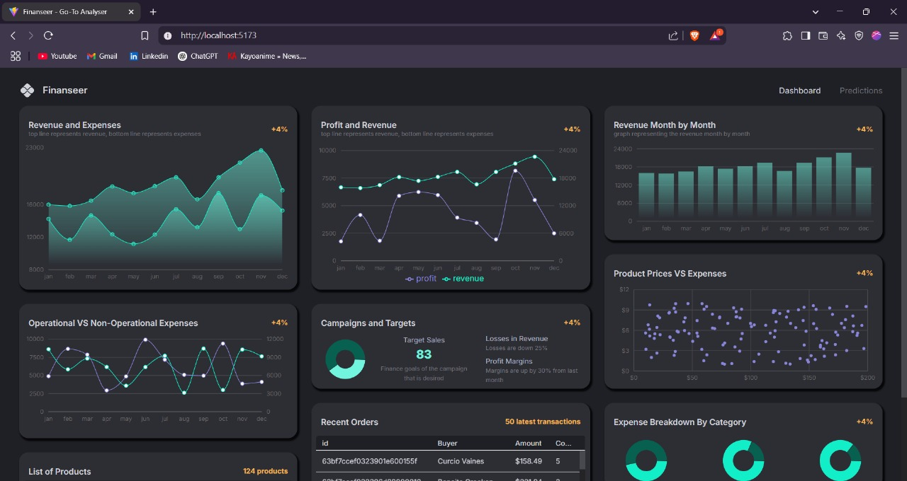
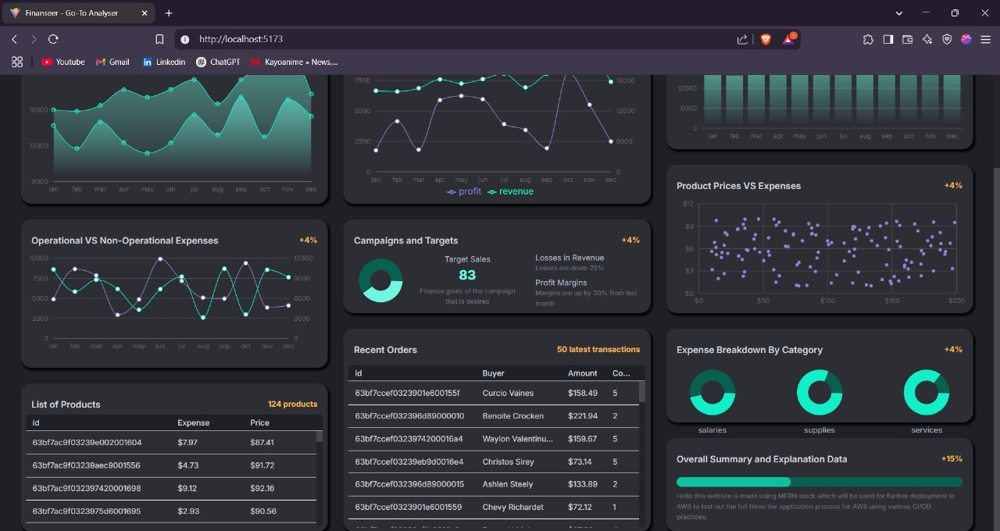
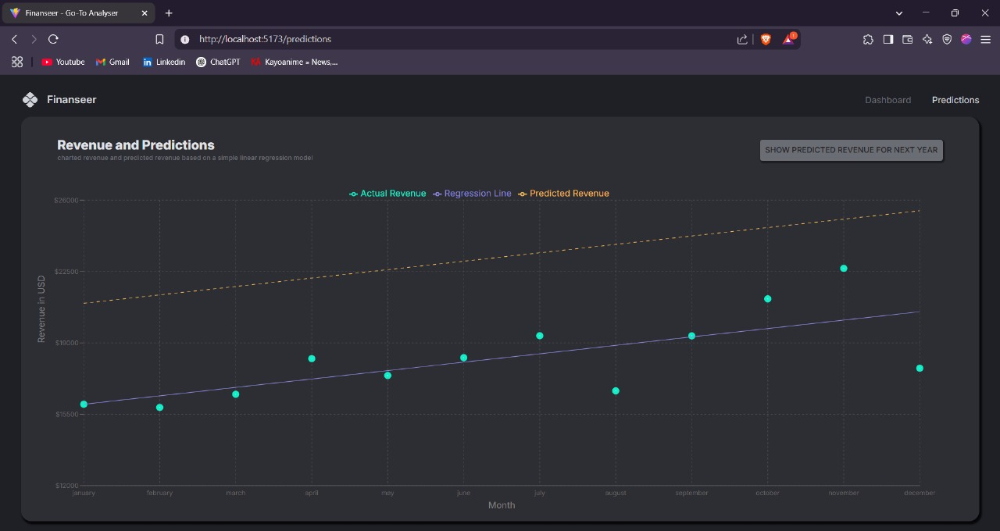

# 💰 Finanseer - Smart Financial Management  

**Finanseer** is your go-to **financial management web app** 🏦, helping you **track expenses, manage budgets, and visualize financial insights** 📊. With a **clean UI, powerful analytics, and secure authentication**, take control of your finances like never before!  

---

## 🚀 Features  
✅ **User Authentication** (🔐 Login/Register)  
✅ **Expense & Income Tracking** (💸📈)  
✅ **Budget Management** (📊 Stay on track)  
✅ **Data Visualization with Charts** (📉📊)  
✅ **Dark Mode Support** (🌙🌓)  
✅ **Secure API with JWT Authentication** (🔑🔒)  
✅ **Role-Based Access Control** (👥 Admin/User)  
✅ **RESTful API using Express** (⚡ Fast & Scalable)  
✅ **MongoDB Database with Mongoose** (🗄️ NoSQL Power)  

---

## 🛠️ Tech Stack  

### 🎨 Frontend  
- ⚛️ **React** with **TypeScript**  
- 🎨 **Material-UI (MUI)** for a sleek UI  
- 🔄 **Redux Toolkit** for state management  
- 🧭 **React Router** for seamless navigation  
- ⚡ **Vite** for ultra-fast development  

### 🏗️ Backend  
- 🟢 **Node.js** with **Express.js**  
- 🍃 **MongoDB** with **Mongoose** ORM  
- 🛡️ **Helmet & CORS** for security enhancements  
- 📜 **Morgan** for logging API requests  

---

## 📌 Get Started  

### 🔧 Install Dependencies  
```bash
# Install frontend dependencies
cd client
npm install

# Install backend dependencies
cd server
npm install
```

### ▶️ Run the Application  
```bash
# Start frontend
cd client
npm run dev

# Start backend
cd server
npm start
```

### 🎯 Environment Variables  
Create a **.env** file in the `server` directory and add:  
```
MONGO_URI=your_mongodb_connection_string
JWT_SECRET=your_secret_key
PORT=5000
```

---

## 📸 Screenshots   

### 📊 Dashboard View  
  

### 📈 Dashboard View 2   
  

### 💵 Regression Predictions  
  

---

## 🤝 Contribute  
💡 Have ideas to improve **Finanseer**? Feel free to **fork, contribute, and submit a pull request**! 🚀  

---

🔹 **Stay financially empowered with Finanseer!** 💰📊✨  
